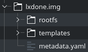

# Virtual Appliance Creation
This is the structure of a **LXDoNe** image, the same as a unified **LXD** tarball:



templates directory contains some start hooks that populates files such as **/etc/hosts** and **/etc/hostname**, metadata.yaml contains some required metadata and rootfs  is a basic linux filesystem. **LXDoNe** uses modified metadata. This structure can be accomplished by several ways. LXDoNe 1702-1 features a script for automatic Virtual Appliance creation, just run as root **image-handling/build-img.sh** you will be asked for size, release and repository, example values are *600M*, *xenial* and *http://archive.ubuntu.com/ubuntu*, those are the default ones if you just press Enter key. The script will result in a raw image called **lxdone.img** ready for OpenNebula, you can ignore the rest of this text unless this script has failed more than once for you or you have containers you want to use:

- **Standard base image(_Simple_)**: use a standard image from https://linuxcontainers.org/images, and dump it into a raw block device
- **Bootstrap(_Quick_)**: generate a rootfs using debootstrap. This is the recommended choice if you have a lack of bandwidth, as previous one will download an 85M tarball, so you only need a repository, although it may take a while due to every package needs to be configured by debootstrap.
- **LXCoNe and LXC**: if you have used **LXCoNe** or you just switched from **LXC** to **LXD** and already have a container you want for OpenNebula.
- **Custom container(_Thorough_)**: create a lxd container and tweak it in order to have your custom virtual appliance. In this option you'll use lxd directly, so if it is the first time you use **LXD** it is the recommended choice, also if you already have used **LXD** and have a container you want for OpenNebula.
- **MarketPlace(_Easy_)**: Download lxdone virtual appliance to your datastore. (Coming soon)

## Block Device creation
At the end of every one of the previous methods you'll have to save your work in a raw image that will be uploaded to a Datastore. So regardless the method you choose you'll have to do this before beginning the method, except for **LXCoNe**:

```
# truncate -s <size_in_GB>G /tmp/lxdone.img
# losetup /dev/loop0 /tmp/lxdone.img
# mkfs.ext4 /dev/loop0
# mount /dev/loop0 /mnt/
```

### Selected method procedure

And this after ending the method. This is valid for **LXCoNe**

```
# cp -rpa addon-lxdone-master/metadata/* /mnt/
# umount /dev/loop0
# losetup -d /dev/loop0
```

#### Warning:
Standard containers fit into 400M images, at the end of each method you'll have to dump something into the raw image, so check there are no errors in the shell output regarding the image ran out of space.

#### Note:
To enable contextualization you'll need to modifiy **/etc/one-context.d/10-network** after [installing one-context package](https://docs.opennebula.org/5.2/operation/vm_setup/kvm.html). Replace get_interface_mac() function with this one:

```
get_interface_mac()
{
    ip link show | awk '/^[0-9]+: [A-Za-z0-9@]+:/ { device=$2; gsub(/:/, "",device); split(device,dev,"\@")} /link\/ether/ { print dev[1]  " " $2 }'
}
```


## Standard Base Image

Fetch the image from the image repository

```
# lxc image export images:lxdone lxdone .
```

Untar the image in the raw block device

```
# tar -xpf lxdone.tar.gz --one-top-level=/mnt/
```

## Bootstrap

Install debbootsrap

```
# apt install debootstrap
```

Generate rootfs. It will take a while to complete.

```
# debootstrap  /mnt/rootfs <your_repository_url>
```


## LXCoNe and LXC

The goal is to reutilize the existing linux filesystem generated with **LXC** and transform your old **LXC** container into a new **LXD** container.

### LXCoNe

Given a lxcone.img raw image containing a linux filesystem.

Mount the old container

```
# losetup /dev/loop0 lxcone.img
# mount /dev/loop0 /mnt/
```

Structure as **LXDoNe** demands

```
# mkdir /mnt/rootfs
# mv /mnt/* /mnt/rootfs
```

### LXC
**LXC** containers rootfs are located by default in **/var/lib/lxc/container/rootfs**, if they were created as standard directories, if they were created as loop devices, the filesystem should be in the block  **/var/lib/lxc/container/rootdev**

#### Standard Directories
Follow **Block Device Creation** at the beginning of this Document. Then

```
# rsync -av /var/lib/lxc/container/rootfs/ /mnt
```

#### Loop device

Mount the loop device

```
# losetup /dev/loop0 /var/lib/lxc/container/rootdev
# mount /dev/loop0 /mnt/
```

Structure as **LXDoNe** demands

```
# mkdir /mnt/rootfs
# mv /mnt/* /mnt/rootfs
```

## Custom container
If you already have a custom container go to the end of the mehod to dump the container into the raw image. Your container is located in **/var/lib/lxd/containers/*your_container/***

### Creation
```
# lxc launch images:16.04 lxdone
```

#### Note:
The above command downloads a base image from [linuxcontainers.org](https://images.linuxcontainers.org).

Now you should have a container named **lxdone** running and . To check the container state:

```
# lxc list
```

The output should be like this:

```
+---------+---------+---------------------+------+------------+-----------+
|  NAME   |  STATE  |        IPV4         | IPV6 |    TYPE    | SNAPSHOTS |
+---------+---------+---------------------+------+------------+-----------+
| lxdone  | RUNNING |                     |      | PERSISTENT | 0         |
+---------+---------+---------------------+------+------------+-----------+
```

### Networking (optional)
If you want to enable networking the container, just add a nic.

```
$ lxc config device add lxdone eth0 nic nictype=bridged parent=lxcbr0
```

### Shell spawn

By default all commands in a LXD container are executed by root

```
# lxc exec lxdone bash
# root@lxdone:
```

#### Container tweaking:
Customize your container all you want

```
root@lxdone: apt install one-context
root@lxdone: passwd
......
......
root@lxdone: exit
# lxc stop lxdone
```

### Dump container into raw image
```
# rsync -av /var/lib/lxd/containers/lxdone/ /mnt/
```
