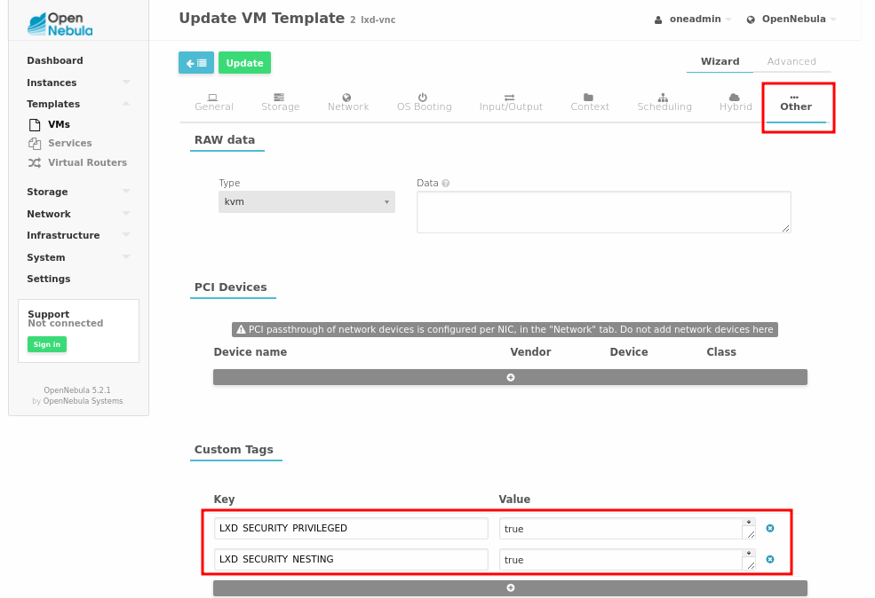

# Installation & Configuration Guide
- The purpose of this guide is to create a fully functional working virtualization node with LXD support.
- For the list of supported features see [Readme](https://github.com/OpenNebula/addon-lxdone/blob/master/README.md#features).


## Table of Contents

<!-- MarkdownTOC -->

- [1 - Frontend Setup](#1---frontend-setup)
  - [1.1 Installation](#11-installation)
  - [1.2 LXDoNe integration](#12-lxdone-integration)
- [2 - Virtualization Node setup](#2---virtualization-node-setup)
  - [2.1 Install required packages](#21-install-required-packages)
  - [2.2 VNC server](#22-vnc-server)
  - [2.3 oneadmin](#23-oneadmin)
  - [2.4 Loopback devices](#24-loopback-devices)
  - [2.5 LXD](#25-lxd)
- [3 - Add a LXD Image](#3---add-a-lxd-image)
- [4 - Add a LXD Virtualization Node to OpenNebula](#4---add-a-lxd-virtualization-node-to-opennebula)
- [5 - Add the LXD bridged network](#5---add-the-lxd-bridged-network)
- [6 - LXD Template Creation in OpenNebula](#6---lxd-template-creation-in-opennebula)
  - [7 - Provision a new LXD Container from the template](#7---provision-a-new-lxd-container-from-the-template)

<!-- /MarkdownTOC -->


<a name="1---frontend-setup"></a>
# 1 - Frontend Setup

<a name="11-installation"></a>
## 1.1 Installation

Follow [frontend installation](https://docs.opennebula.org/5.2/deployment/opennebula_installation/frontend_installation.html) in the OpenNebula deployment guide.


<a name="12-lxdone-integration"></a>

<a name="12-lxdone-integration"></a>
## 1.2 LXDoNe integration

* The **LXDoNe** drivers must be installed on the OpenNebula ***frontend*** server to add LXD virtualization and monitoring support. 


<a name="121-drivers"></a>

### 1.2.1 Drivers
#### Download the [latest release](https://github.com/OpenNebula/addon-lxdone/releases/) and extract it to the oneadmin drivers directory

```bash
tar -xf <lxdone-release>.tar.gz
cp -r addon-lxdone-*/src/remotes/ /var/lib/one/
```


#### Set the appropriate permissions on the newly installed drivers

```bash
cd /var/lib/one/remotes/
chown -R oneadmin:oneadmin vmm/lxd im/lxd*
chmod 755 -R vmm/lxd im/lxd*
chmod 644 im/lxd.d/collectd-client.rb
cd -
```


#### Optional: Add support for 802.1Q driver (VLANs).

Replace **/var/lib/one/remotes/vnm.rb** with the one from the **addon-lxdone**.

```bash
cp -rpa src/one_wait/nic.rb /var/lib/one/remotes/vnm/nic.rb
chown oneadmin:oneadmin /var/lib/one/remotes/vnm/nic.rb
chmod 755 /var/lib/one/remotes/vnm/nic.rb
```

**Note**: *A **[pull request](https://github.com/OpenNebula/one/pull/189)** has been made to OpenNebula's official Network Driver to add 802.1Q functionality by default.*


<a name="122-enable-lxd"></a>

### 1.2.2 Enable LXD

Modify **/etc/one/oned.conf** as root.
Under **Information Driver Configuration** add this:

```
#---------------------------
# lxd Information Driver Manager Configuration
# -r number of retries when monitoring a host
# -t number of threads, i.e. number of hosts monitored at the same time
#---------------------------
IM_MAD = [ NAME = "lxd",
EXECUTABLE = "one_im_ssh",
ARGUMENTS = "-r 3 -t 15 lxd" ]
#---------------------------
```

Under **Virtualization Driver Configuration** add this:

```
#---------------------------
# lxd Virtualization Driver Manager Configuration
# -r number of retries when monitoring a host
# -t number of threads, i.e. number of actions performed at the same time
#---------------------------
VM_MAD = [ NAME = "lxd",
EXECUTABLE = "one_vmm_exec",
ARGUMENTS = "-t 15 -r 0 lxd",
KEEP_SNAPSHOTS = "yes",
TYPE = "xml",
IMPORTED_VMS_ACTIONS = "migrate, live-migrate, terminate, terminate-hard, undeploy, undeploy-hard, hold, release, stop, suspend, resume, delete, delete-recreate, reboot, reboot-hard, resched, unresched, poweroff, poweroff-hard, disk-attach, disk-detach, nic-attach, nic-detach, snap-create, snap-delete"]
#---------------------------

```

Restart OpenNebula

```bash
systemctl restart opennebula
```


<a name="2-virtualization-node-setup"></a>

<a name="2---virtualization-node-setup"></a>
# 2 - Virtualization Node setup

- Follow [KVM Node Installation](https://docs.opennebula.org/5.2/deployment/node_installation/kvm_node_installation.html#), up to [step 6](https://docs.opennebula.org/5.2/deployment/node_installation/kvm_node_installation.html#step-6-storage-configuration).
- If you want to use **Ceph** to store Virtual Images, follow [Ceph Datastore Guide](https://docs.opennebula.org/5.2/deployment/open_cloud_storage_setup/ceph_ds.html) and configure it just as you would for **KVM**.


### Installed KVM Packages which are not needed for LXD support

- The ***opennebula-node*** package installs kvm-required software.
- Many of the KVM packages may be removed if you do not want to support KVM VM's.
- If you will be using **Ceph storage**, do not remove the **libvirt** package, it is required for Ceph storage.


<a name="21-install-required-packages"></a>

<a name="21-install-required-packages"></a>
## 2.1 Install required packages

### Ubuntu 16.04 (Xenial Xerus)

```bash
apt install lxd lxd-tools python-pylxd/xenial-updates \
                criu bridge-utils \
                python-ws4py python-pip
```

#### Check that pylxd 2.0.5 or the LXD driver will not work correctly

```bash
dpkg -s python-pylxd | grep 2.0.5 || echo "ERROR pylxd version not 2.05"
```


### Install isoparser

*This python library can parse the ISO 9660 disk image format including Rock Ridge extensions.*

```bash
pip install isoparser
```

<a name="22-vnc-server"></a>


<a name="22-vnc-server"></a>
## 2.2 VNC server

- **LXDoNe** uses **[Simple VNC Terminal Emulator (svncterm)](https://github.com/dealfonso/svncterm)** as the **VNC** server.
- svncterm is a fork of [vncterm](https://github.com/proxmox/vncterm), with a simplified codebase, including *the removal of tls support*.
- svncterm allows the **VNC** option to be used in the VM template definition.
- We provide a pre-created package for ubuntu 16.04 un our releases section.For compiling svncterm for your distro follow instructions on svncterm's [README](https://github.com/dealfonso/svncterm/blob/master/README)

### Install svncterm


```bash
wget https://github.com/OpenNebula/addon-lxdone/releases/download/v5.2-4.1/svncterm_1.2-1ubuntu_amd64.deb
apt install libjpeg62 libvncserver1 && dpkg -i svncterm_1.2-1ubuntu_amd64.deb
```

<a name="23-oneadmin"></a>
## 2.3 oneadmin

Allow oneadmin to execute commands as root using **sudo** and add it to the **lxd group**.

```bash
echo "oneadmin ALL= NOPASSWD: ALL" >> /etc/sudoers.d/oneadmin
usermod -a -G lxd oneadmin
```

<a name="24-loopback-devices"></a>
## 2.4 Loopback devices

- Every file system image used by **LXDoNe** will require one ***loop device***.
- The default limit for ***loop devices*** is 8.
- To allow the system to run more LXD containers than 8, the loopback device limit must be increased:

```bash
echo "options loop max_loop=128" >> /etc/modprobe.d/local-loop.conf
echo "loop" >> /etc/modules-load.d/modules.conf
depmod
```

<a name="25-lxd"></a>
## 2.5 LXD

<a name="251-daemon"></a>
### 2.5.1 Configure the LXD Daemon
- By **default**, LXD does not activate a TCP listener, it listens on a **local unix socket**, and so it's not available via the network.

```bash
lsof | grep -i lxd | egrep --color '(LISTEN|sock)'

lxc config show
```


- To use LXD with OpenNebula and the LXDoNe driver, we need to configure LXD to have a **TCP listener**.

```bash
lxd init --auto \
         --storage-backend dir \
         --network-address 0.0.0.0 \
         --network-port    8443 \
         --trust-password  password
         
lsof | grep -i lxd | egrep --color '(LISTEN|sock)'

lxc config show
```

* **storage-backend**: LXD supports many different storage backend types.
  * Common backends are the **ZFS** filesystem or **dir**.
  * If **dir** is chosen, then the local filesystem location *(/var/lib/lxd/containers)* will be used for storage.
* **network-address**: 0.0.0.0 will instruct LXD to listen on all available IP's and interfaces.
* **trust-password**: used by remote clients to vouch for their client certificate.
  * By default, LXD will allow all members of group **lxd** to talk to it over the UNIX socket.
  * Remote TCP network communication is authorized using SSL certificates.
  * **When a new remote client registers with LXD as a known remote client, the trust password is provided.** Once the remote client's certificates has been trusted by LXD, the trust password will not need to be re-entered.


<a name="252-lxd-profile"></a>

### 2.5.2 LXD Profile
- Containers inherit properties from a configuration profile.
- The installation of LXD will create a **default** profile which needs to be modified to work with OpenNebula.

```bash
lxc profile list
lxc profile show default
```


#### Network
- The **default** profile contains a definition  for the **eth0 network device**.
- Because eth0 is not managed by OpenNebula, the **eth0 device needs to be removed** from the profile.

```bash
lxc profile device remove default eth0
```


#### Security and Nesting

* By **default**, containers will operate [**unprivileged**](http://linuxcontainers.org/lxc/security/#privileged-containers).
* By **default**, **[nesting](https://insights.ubuntu.com/2015/10/30/nested-containers-in-lxd/) is [disabled](https://insights.ubuntu.com/2016/04/15/lxd-2-0-lxd-in-lxd-812/)**.

```bash
lxc profile unset default security.privileged
lxc profile unset default security.nesting
```


<a name="253-user-ids"></a>

### 2.6.3 User IDs

- Containers run in namespaces.
- A user namespace has a mapping from host uids to container uids.
- For instance, the range of host uids 100000-165536 might be mapped to container uids 0-65536.
- The **subordinate user id** *(subuid)* and **subordinate group id** *(subgid)* files must have entries for lxd and root to allow LXD containers to work.
- The LXDoNe recommended starting ID is 100000, with a range of 65536.

```bash
egrep --color '(lxd|root)' /etc/subuid /etc/subgid

lxd:100000:65536
root:100000:65536
```


<a name="3-add-lxd-image"></a>

<a name="3---add-a-lxd-image"></a>
# 3 - Add a LXD Image
- **LXD** native images are basically compressed files.
- However, **OpenNebula** uses block based images by default.
- Because the formats are different, the **default LXD images will not work** with LXDoNe.
- LXD Images must be converted to the OpenNebula compatible format. More information about **creating OpenNebula compatible LXD images** is available [here](Image.md)


### Download pre-built image

- **Download** a pre-build **OpenNebula-compatible LXD Image for Ubuntu 16.04** from the [OpenNebula marketplace](https://marketplace.opennebula.systems/appliance/7dd50db7-33c4-4b39-940c-f6a55432622f). 
- The **default username** is: **team**
- The **default password** for the team user is: **team**

#### We also keep the images in:
 - [MEGA](https://mega.nz/#!U8pXxBpI!2UjFmQO8Fr8hz5oHt7z6QeIqYR3ziZ74OcNP1HByO4c)
 - [Dropbox](https://www.dropbox.com/s/p9s1tzc47tpgxqg/lxdone-5.2-4.1.img.tar.xz?dl=0)
 - [Google Drive](https://drive.google.com/open?id=0B6vgzbpLofKjbXFzTjI1QmZ4X1U)


<a name="4-add-lxd-node"></a>

<a name="4---add-a-lxd-virtualization-node-to-opennebula"></a>
# 4 - Add a LXD Virtualization Node to OpenNebula


- In the **OpenNebula web console** in the **Infrastructure** section
- Choose **Hosts**
- **Create** a Host.


* Type: **Custom**
* **The host name must be unique**. For example, if you already have a localhost, you must add localhost_lxd. *Any custom names must have corresponding DNS or /etc/host entries.*
* Drivers:
    * Virtualization: Select **Custom**
    * Information: Select **Custom**
    * Custom VMM_MAD: **lxd**
    * Custom IM_MAD: **lxd**


<a name="5-add-the-lxd-bridge"></a>

<a name="5---add-the-lxd-bridged-network"></a>
# 5 - Add the LXD bridged network

- In the **OpenNebula web console** in the **Network** section
- Choose **Virtual Networks**
- **Create** a new network

* On the **General tab**
    * Set the Name
* On the **Conf tab**
    * Bridge **br0** or **lxdbr0**
* On the **Addresses tab**
    * Select **IPv4** if using **br0**, **Ethernet** if using **lxdbr0**, or an external **DHCP** service
    * **First IP/MAC address**: some private IP available on the network.
    * Size: 200


<a name="6---lxd-template-creation-in-opennebula"></a>
# 6 - LXD Template Creation in OpenNebula

- In the **OpenNebula web console** in the **Templates** section
- Choose **VMs**
- **Create** a VM Template.

* General:
    * Name
    * Memory (ex. 32MB)
    * CPU (ex. 0.1)
    * VCPU (optional ex. 1)
      * VCPU stands for the amount of cores the container can use.
      * If left blank, the container will use all the cores up to a fraction defined by the CPU.
      * For a host with 8 CPUs, if the VM template states 2 VCPU, then the container has 2/8 CPUs allocated.
        ​
* Storage:
    * Select on Disk 0 the source image ID that will provide the disk.


### Optional data:
* Network:
    * Select one or many network interfaces. They will appear inside the container configured.
* Input/Output:
    * Select **VNC** under graphics.
    * Server port
* Other:
    * LXD_SECURITY_NESTING = '**true**' for creating containers inside the container.
    * LXD_SECURITY_PRIVILEGED = '**true**' for make the container privileged.


 


<a name="7-provision"></a>

<a name="7---provision-a-new-lxd-container-from-the-template"></a>
## 7 - Provision a new LXD Container from the template
- In the **OpenNebula web console** in the **Instances** section
- Choose **VMs**
- **Add** a VM
- Select an LXD template and click **Create**.
- Wait for the scheduler to execute the drivers.
- In the Log section there will be additional information like the time spent on executing actions scripts and any errors if they occur.


- If VNC is enabled for the container, the graphic session will start in the login prompt inside the container.

